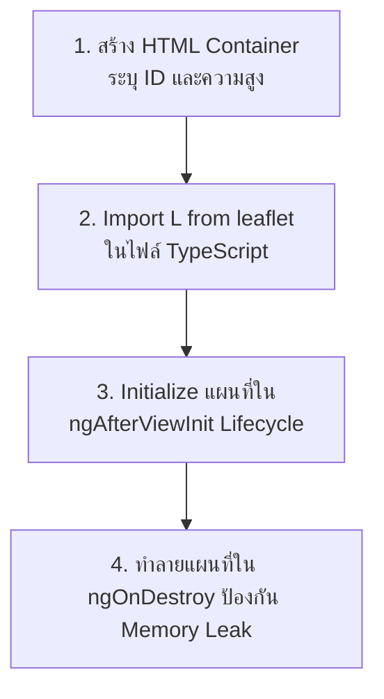

---
tags:
  - guide
  - leaflet
  - openstreetmap
  - angular
  - setup
  - code-explanation
title: คู่มือการใช้งานและการอธิบายโค้ด Leaflet Map ใน Angular 22
---

# 🗺️ คู่มือการใช้งานและการอธิบายโค้ด Leaflet Map ใน Angular 22
> [!INFO] **เอกสารอ้างอิง:** [[PROJECT_PLAN|กลับสู่หน้าแผนแม่บท]] | **หน้าใช้งานในระบบ:** [[01-CUSTOMER|ระบบจัดการลูกค้า]] และ [[03-ROUTE-AND-SUMMARY|ระบบจัดเส้นทาง]]

---

## 🔍 1. รายการไฟล์ที่เกี่ยวข้องในโปรเจกต์ (File Checklist)

เมื่อสมาชิกโคลนโปรเจกต์ลงมาที่เครื่อง ให้ตรวจสอบไฟล์สำคัญเหล่านี้ว่ามีการตั้งค่าพร้อมใช้งานแล้วหรือไม่:

| ลำดับ | ไฟล์ที่ต้องตรวจสอบ | สิ่งที่ต้องตรวจสอบภายในไฟล์ |
|:---|:---|:---|
| 1 | `package.json` | มี `"leaflet": "^1.9.4"` ใน `dependencies` และ `"@types/leaflet": "^1.9.22"` ใน `devDependencies` |
| 2 | `src/styles.css` | มีบรรทัด `@import "leaflet/dist/leaflet.css";` และการกำหนดความสูงของ container |
| 3 | `src/app/pages/customer-management/` | ไฟล์ของหน้าจัดการลูกค้าที่มีการเรียกใช้แผนที่เพื่อปักหมุดและเลือกพิกัด |
| 4 | `src/app/pages/route-dashboard/` | ไฟล์ของหน้าจัดเส้นทางที่มีการวาด Polyline แยกสีของไรเดอร์แต่ละคน |
| 5 | `src/environments/environment.ts` | พิกัดจุดศูนย์กลางร้านค้า (ม.มหาสารคาม: Lat `16.245000`, Lng `103.250000`) |

---

## 🚀 2. ขั้นตอนการตั้งค่าเมื่อโคลนโปรเจกต์ลงเครื่อง (Setup Guide)

### ขั้นตอนที่ 2.1: ติดตั้ง Dependencies
เมื่อโคลนโปรเจกต์มาเรียบร้อยแล้ว ให้เปิด Terminal ที่โฟลเดอร์โปรเจกต์แล้วรันคำสั่ง:

```bash
# ติดตั้ง Library ทั้งหมดตาม package.json (รวม leaflet และ @types/leaflet)
npm install
```

> [!TIP]
> ในกรณีที่สร้างโปรเจกต์ใหม่หรือยังไม่มี package ให้รัน:
> ```bash
> npm install leaflet
> npm install --save-dev @types/leaflet
> ```

---

### ขั้นตอนที่ 2.2: ตรวจสอบการโหลด Leaflet CSS ใน `src/styles.css`
เปิดไฟล์ `src/styles.css` และตรวจสอบให้แน่ใจว่ามีการนำเข้า CSS ดังนี้:

```css
/* src/styles.css */
@import "tailwindcss";
@import "leaflet/dist/leaflet.css";

/* ป้องกันปัญหา Leaflet Container ยุบตัวเป็นความสูง 0 */
.map-container {
  width: 100%;
  height: 450px;
  min-height: 320px;
  border-radius: 0.75rem;
}
```

> [!WARNING] **คำอธิบาย:**
> แผนที่ Leaflet **ต้องมีการระบุความสูง (Height) เสมอ** หากไม่มีความสูง แผนที่จะไม่แสดงผลบนหน้าจอ (กลายเป็นความสูง 0px)

---

## 💻 3. วิธีการนำ Leaflet ไปใช้งานใน Angular Component พร้อมคำอธิบายโค้ด

การใช้งาน Leaflet ใน Angular Component มี 4 ขั้นตอนหลัก:



### ขั้นตอนที่ 3.1: กำหนดพื้นที่แสดงแผนที่ใน HTML Template
ในไฟล์ `.html` ของคอมโพเนนต์ (เช่น `customer-management.html` หรือ `route-dashboard.html`):

```html
<!-- ระบุ id ให้ไม่ซ้ำกัน เช่น customer-map หรือ route-map -->
<div id="customer-map" class="map-container border border-gray-200 shadow-sm"></div>
```

**🔍 อธิบายโค้ด HTML:**
- `id="customer-map"`: เป็นชื่อ Identifier ที่จะส่งไปให้คำสั่ง `L.map('customer-map')` ในไฟล์ TypeScript ใช้อ้างอิงตำแหน่ง Render
- `class="map-container"`: ดึงสไตล์ความสูง `height: 450px` ที่เราประกาศไว้ใน `styles.css` มาใช้งาน

---

### ขั้นตอนที่ 3.2: เขียนโค้ดในไฟล์ TypeScript (`.ts`)

```typescript
import { Component, AfterViewInit, OnDestroy } from '@angular/core';
import * as L from 'leaflet';

@Component({
  selector: 'app-customer-management',
  standalone: true,
  templateUrl: './customer-management.html',
  styleUrl: './customer-management.css'
})
export class CustomerManagement implements AfterViewInit, OnDestroy {
  // ตัวแปรเก็บ Instance ของแผนที่
  private map?: L.Map;
  
  // LayerGroup สำหรับเก็บหมุดหรือเส้นทาง เพื่อให้สั่งลบหรือวาดใหม่ได้ง่าย
  private markersLayer = L.layerGroup();

  // 1. สร้างแผนที่ใน ngAfterViewInit (รอให้ HTML DOM พร้อมก่อน)
  ngAfterViewInit(): void {
    this.initMap();
  }

  private initMap(): void {
    // กำหนดพิกัดกึ่งกลางที่ ม.มหาสารคาม (16.245000, 103.250000) Zoom ระดับ 14
    this.map = L.map('customer-map').setView([16.245000, 103.250000], 14);

    // โหลดภาพแผ่นแผนที่ (Tile Layer) จาก OpenStreetMap
    L.tileLayer('https://{s}.tile.openstreetmap.org/{z}/{x}/{y}.png', {
      attribution: '&copy; OpenStreetMap contributors',
      maxZoom: 19
    }).addTo(this.map);

    // ผูก LayerGroup เข้ากับ Map
    this.markersLayer.addTo(this.map);

    // ดักจับ Event เมื่อคลิกบนแผนที่ เพื่อดึงพิกัด Latitude และ Longitude
    this.map.on('click', (e: L.LeafletMouseEvent) => {
      const lat = parseFloat(e.latlng.lat.toFixed(6));
      const lng = parseFloat(e.latlng.lng.toFixed(6));
      console.log(`พิกัดที่คลิก: Lat=${lat}, Lng=${lng}`);
    });
  }

  // 2. คืนหน่วยความจำเมื่อออกจากหน้า (สำคัญมาก)
  ngOnDestroy(): void {
    this.map?.remove();
  }
}
```

---

## 📖 4. อธิบายการทำงานของฟังก์ชัน Leaflet แต่ละส่วนอย่างละเอียด

### 4.1 การสร้างแผนที่ (`L.map` และ `setView`)
```typescript
this.map = L.map('customer-map').setView([16.245000, 103.250000], 14);
```
- **`L.map('customer-map')`**: สั่งให้ Leaflet สร้างแผนที่ลงใน `<div id="customer-map">`
- **`.setView([lat, lng], zoomLevel)`**:
  - `[16.245000, 103.250000]`: กำหนดพิกัดกึ่งกลางเริ่มต้น (บริเวณ ม.มหาสารคาม)
  - `14`: กำหนดระดับการซูม (ตัวเลขยิ่งมาก ยิ่งซูมใกล้เห็นรายละเอียดถนนชัดเจน)

---

### 4.2 การโหลดภาพแผนที่ (`L.tileLayer`)
```typescript
L.tileLayer('https://{s}.tile.openstreetmap.org/{z}/{x}/{y}.png', {
  attribution: '&copy; OpenStreetMap contributors',
  maxZoom: 19
}).addTo(this.map);
```
- **`https://{s}.tile.openstreetmap.org/...`**: เป็น URL Server ที่ให้บริการภาพแผนที่ฟรีจาก OpenStreetMap
- **`maxZoom: 19`**: ระดับการซูมสูงสุดที่รองรับ
- **`.addTo(this.map)`**: สั่งให้นำภาพแผนที่ไปแสดงผลบนแผนที่หลัก

---

### 4.3 การดักจับคลิกบนแผนที่เพื่อเลือกพิกัด (`map.on('click')`)
```typescript
this.map.on('click', (e: L.LeafletMouseEvent) => {
  const lat = parseFloat(e.latlng.lat.toFixed(6));
  const lng = parseFloat(e.latlng.lng.toFixed(6));
  
  // นำค่าไปใส่ใน Model ฟอร์มลูกค้า
  this.formData.latitude = lat;
  this.formData.longitude = lng;
});
```
- **`e.latlng`**: คือ Object ที่ Leaflet ส่งมาให้เมื่อมีการคลิก ซึ่งเก็บค่า `.lat` และ `.lng` ของจุดที่ผู้ใช้คลิก
- **`.toFixed(6)`**: ปัดเศษทศนิยมให้อยู่ที่ 6 ตำแหน่ง (มาตรฐานความแม่นยำระดับพิกัด GPS)

---

### 4.4 การสร้าง Custom Marker ด้วย HTML/Tailwind (`L.divIcon`)
แก้ปัญหาไอคอนรูปภาพ PNG ค่าเริ่มต้นของ Leaflet โหลดไม่ขึ้น (Icon 404):

```typescript
// สร้างไอคอนหมุดร้านค้า
const shopIcon = L.divIcon({
  className: 'custom-shop-pin',
  html: '<div class="bg-red-600 text-white font-bold text-xs px-2.5 py-1 rounded-full shadow-lg border-2 border-white">🏠 ร้านข้าวกล่อง</div>',
  iconSize: [100, 30] // ขนาด กว้าง x สูง (px)
});

// ปักหมุดลงแผนที่พร้อมข้อความ Popup
L.marker([16.245000, 103.250000], { icon: shopIcon })
  .bindPopup('<b>จุดเริ่มต้นจัดส่ง (11:30 น.)</b>')
  .addTo(this.map);
```
- **`L.divIcon()`**: สร้างหมุดจากโค้ด HTML แทนไฟล์รูปภาพ ทำให้เราตกแต่งสีและใส่สไตล์ Tailwind CSS ได้อิสระ
- **`L.marker([lat, lng], { icon })`**: สร้างวัตถุหมุดที่พิกัดที่กำหนด
- **`.bindPopup('...')`**: สร้างหน้าต่างกล่องข้อความที่จะเด้งขึ้นมาเมื่อคลิกที่หมุด

---

### 4.5 การสร้างหมุดหมายเลขจุดส่งตามสีของไรเดอร์ (ลำดับ 1, 2, 3)
```typescript
const stopIcon = L.divIcon({
  className: 'custom-stop-pin',
  html: `<div style="background-color: ${riderColor}" class="w-7 h-7 text-white font-black text-xs rounded-full flex items-center justify-center border-2 border-white shadow-md">${sequence}</div>`,
  iconSize: [28, 28]
});

L.marker([customerLat, customerLng], { icon: stopIcon })
  .bindPopup(`<b>จุดที่ ${sequence}: คุณ ${customerName}</b><br>📦 จำนวน: ${boxQty} กล่อง`)
  .addTo(this.markersLayer);
```
- **`${riderColor}`**: กำหนดสีพื้นหลังของหมุดให้ตรงกับสีประจำตัวของไรเดอร์ (เช่น แดง, เขียว, น้ำเงิน)
- **`${sequence}`**: แสดงหมายเลขลำดับจุดส่ง (1, 2, 3) ภายในหมุด

---

### 4.6 การวาดเส้นทาง Polyline แยกสีของไรเดอร์แต่ละคน
```typescript
// points คือ Array ของพิกัด เช่น [[16.245, 103.25], [16.248, 103.252], ...]
const polyline = L.polyline(points, {
  color: riderColor, // กำหนดสีเส้นทาง เช่น '#EF4444' (แดง)
  weight: 5,         // ความหนาของเส้น (px)
  opacity: 0.85      // ความทึบแสง (0.0 ถึง 1.0)
}).addTo(this.routesLayer);

// ปรับให้แผนที่ Zoom และเลื่อนตำแหน่งให้เห็นครบทุกจุดในเส้นทางพอดี
this.map?.fitBounds(L.latLngBounds(points), { padding: [30, 30] });
```
- **`L.polyline(points, options)`**: วาดเส้นตรงเชื่อมต่อตามจุดพิกัดใน Array
- **`map.fitBounds(bounds)`**: สั่งให้แผนที่ปรับขนาดและระดับการซูมอัตโนมัติ เพื่อให้ผู้ใช้มองเห็นเส้นทางทั้งหมดโดยไม่ต้องเลื่อนหาเอง

---

### 4.7 การวาดวงกลมแสดงรัศมี 1 กม. หรือ 2 กม. (`L.circle`)
```typescript
const circle = L.circle([16.245000, 103.250000], {
  radius: 1000,        // รัศมีในหน่วยเมตร (1000 เมตร = 1 กิโลเมตร)
  color: '#2563EB',    // สีของเส้นขอบวงกลม
  fillColor: '#3B82F6',// สีพื้นหลังด้านในวงกลม
  fillOpacity: 0.15    // ความโปร่งใสของพื้นหลัง
}).addTo(this.map);

// ปรับให้แผนที่ Zoom พอดีกับวงกลมรัศมี
this.map?.fitBounds(circle.getBounds());
```

---

### 4.8 การล้างข้อมูลเดิมก่อนวาดใหม่ (`LayerGroup.clearLayers`)
```typescript
clearOldRoutes(): void {
  // ล้างหมุดและเส้นทางเดิมทั้งหมดที่ผูกอยู่ใน LayerGroup
  this.markersLayer.clearLayers();
}
```
- **`clearLayers()`**: ลบทุกหมุดและเส้นที่อยู่ใน LayerGroup ออกจากหน้าจอพร้อมกันในคำสั่งเดียว นิยมใช้เมื่อผู้ใช้กด **"คำนวณใหม่"** หรือค้นหาชุดข้อมูลใหม่

---

### 4.9 การทำลายแผนที่เมื่อออกจากหน้า (`ngOnDestroy`)
```typescript
ngOnDestroy(): void {
  // ทำลาย Instance ของแผนที่เพื่อป้องกัน Memory Leak
  this.map?.remove();
}
```
- **`this.map?.remove()`**: คืนหน่วยความจำและลบ Event Listener ทั้งหมดของแผนที่ ป้องกันปัญหาเมื่อสลับหน้าแล้วแผนที่ซ้อนกัน

---

## 🛠️ 5. วิธีแก้ปัญหาที่พบบ่อย (Troubleshooting)

> [!CAUTION] **ปัญหา 1: แผนที่โหลดขึ้นมาแล้วเป็นสีเทา หรือขนาดผิดเพี้ยน**
> **สาเหตุ:** เกิดจากการเรนเดอร์ใน Tab, Modal หรือหน้าจอที่มีการซ่อน/แสดงผล ทำให้ Leaflet คำนวณขนาดหน้าจอตอนแรกไม่ถูกต้อง  
> **วิธีแก้:** เรียกคำสั่ง `invalidateSize()` หลังจากแสดงผล:
> ```typescript
> setTimeout(() => {
>   this.map?.invalidateSize();
> }, 150);
> ```

> [!CAUTION] **ปัญหา 2: แผนที่ซ้อนกัน หรือ Error "Map container is already initialized"**
> **สาเหตุ:** ไม่ได้ลบ Instance แผนที่เดิมเมื่อออกจาก Component ก่อนจะสร้างใหม่  
> **วิธีแก้:** ต้องใส่ `this.map?.remove()` ใน `ngOnDestroy()` เสมอ
