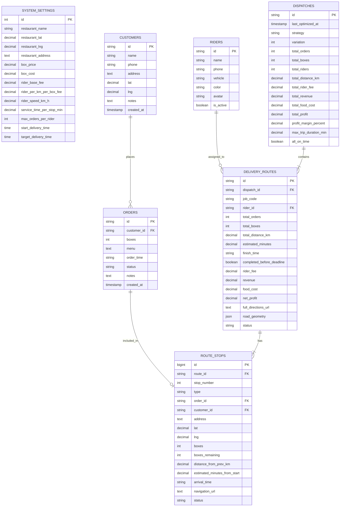

# 🗄️ Database Schema & API Architecture Design
> สำหรับระบบ **Route Optimization & Cost Analysis Delivery System**

เอกสารนี้ระบุรายละเอียดการออกแบบโครงสร้างฐานข้อมูลแบบ **Relational Database (PostgreSQL / MySQL / SQL Server)** เพื่อแทนที่การเก็บข้อมูลแบบ JSON Files พร้อมรองรับการประมวลผลอัลกอริทึมคำนวณเส้นทางและเชื่อมต่อผ่าน RESTful Web API

---

## 1. รายชื่อตารางใน Database (Database Tables)

```text
├── 1. system_settings   (ตารางการตั้งค่าระบบและร้านค้า)
├── 2. customers         (ตารางข้อมูลลูกค้าและพิกัด)
├── 3. riders            (ตารางข้อมูลไรเดอร์ / คนขับ)
├── 4. orders            (ตารางรายการออเดอร์ของลูกค้า)
├── 5. dispatches        (ตารางรอบการจัดสายส่ง / Batch Optimization)
├── 6. delivery_routes   (ตารางสายส่งของไรเดอร์แต่ละคันในรอบนั้น)
└── 7. route_stops       (ตารางจุดแวะ/ลำดับส่งของแต่ละสายส่ง)
```

---

## 2. รายละเอียดโครงสร้างแต่ละตาราง (Table Schemas)

### 1) ตาราง `system_settings` (ตั้งค่าระบบและต้นทุน)
> ใช้เก็บค่าคงที่และพารามิเตอร์สำหรับอัลกอริทึมคำนวณเส้นทางและคำนวณต้นทุน/กำไร

| Column Name | Data Type | Key | Description / การใช้งาน |
| :--- | :--- | :---: | :--- |
| `id` | INT / VARCHAR | **PK** | รหัสตั้งค่า (เช่น 1 หรือ 'DEFAULT') |
| `restaurant_name` | VARCHAR(255) | | ชื่อร้านต้นทาง |
| `restaurant_lat` | DECIMAL(10, 7) | | ละติจูดร้าน (จุดเริ่มต้นส่ง) |
| `restaurant_lng` | DECIMAL(10, 7) | | ลองจิจูดร้าน |
| `restaurant_address`| TEXT | | ที่อยู่ร้านค้า |
| `box_price` | DECIMAL(10, 2) | | ราคาขายต่อกล่อง (คำนวณ Revenue) |
| `box_cost` | DECIMAL(10, 2) | | ต้นทุนอาหารต่อกล่อง (คำนวณ Food Cost) |
| `rider_base_fee` | DECIMAL(10, 2) | | ค่าจ้างขั้นต่ำไรเดอร์ต่อเที่ยว |
| `rider_per_km_per_box_fee` | DECIMAL(10, 2) | | ค่าจ้างผันแปรต่อ กม. ต่อกล่อง |
| `rider_speed_km_h` | DECIMAL(5, 2) | | ความเร็วเฉลี่ยไรเดอร์ (กม./ชม.) |
| `service_time_per_stop_min` | DECIMAL(5, 2) | | เวลาเฉลี่ยที่ใช้ส่งต่อ 1 จุด (นาที) |
| `max_orders_per_rider` | INT | | จำนวนออเดอร์สูงสุดที่ไรเดอร์ 1 คนรับได้ |
| `start_delivery_time` | TIME | | เวลาเริ่มจัดส่ง (เช่น '11:30') |
| `target_delivery_time` | TIME | | เวลาเป้าหมายที่ต้องส่งเสร็จ (เช่น '12:30') |
| `max_delivery_window_min` | INT | | กรอบเวลาจัดส่งสูงสุด (นาที) |
| `updated_at` | TIMESTAMP | | เวลาที่อัปเดตล่าสุด |

---

### 2) ตาราง `customers` (ข้อมูลลูกค้า)
> ใช้เก็บข้อมูลโปรไฟล์และพิกัดหมุดลูกค้า สำหรับสร้างออเดอร์และคำนวณระยะทาง

| Column Name | Data Type | Key | Description / การใช้งาน |
| :--- | :--- | :---: | :--- |
| `id` | VARCHAR(50) | **PK** | รหัสลูกค้า (เช่น 'CUST-01') |
| `name` | VARCHAR(150) | | ชื่อ-นามสกุลลูกค้า |
| `phone` | VARCHAR(30) | | เบอร์โทรศัพท์ |
| `address` | TEXT | | ที่อยู่จัดส่ง / ชื่ออาคาร |
| `lat` | DECIMAL(10, 7) | | ละติจูดพิกัดจัดส่ง |
| `lng` | DECIMAL(10, 7) | | ลองจิจูดพิกัดจัดส่ง |
| `notes` | TEXT | | รายละเอียดเพิ่มเติม / จุดสังเกต |
| `created_at` | TIMESTAMP | | วันที่บันทึกข้อมูล |

---

### 3) ตาราง `riders` (ข้อมูลไรเดอร์)
> ใช้เก็บข้อมูลไรเดอร์ ยานพาหนะ และสถานะความพร้อมรับงาน

| Column Name | Data Type | Key | Description / การใช้งาน |
| :--- | :--- | :---: | :--- |
| `id` | VARCHAR(50) | **PK** | รหัสไรเดอร์ (เช่น 'RD-01') |
| `name` | VARCHAR(150) | | ชื่อไรเดอร์ |
| `phone` | VARCHAR(30) | | เบอร์โทรศัพท์ติดต่อ |
| `vehicle` | VARCHAR(100) | | ยานพาหนะและทะเบียน (เช่น 'Wave 110i สีแดง') |
| `color` | VARCHAR(20) | | รหัสสีประจำตัว (เช่น '#EF4444' สำหรับวาดเส้น Map) |
| `avatar` | VARCHAR(50) | | อีโมจิหรือ URL รูปภาพโปรไฟล์ |
| `is_active` | BOOLEAN | | สถานะพร้อมทำงานหรือไม่ |

---

### 4) ตาราง `orders` (รายการออเดอร์)
> ใช้เก็บคำสั่งซื้อของแต่ละวัน สถานะการจัดส่ง และเมนูอาหาร

| Column Name | Data Type | Key | Description / การใช้งาน |
| :--- | :--- | :---: | :--- |
| `id` | VARCHAR(50) | **PK** | รหัสออเดอร์ (เช่น 'ORD-101') |
| `customer_id` | VARCHAR(50) | **FK** | อ้างอิง `customers.id` |
| `boxes` | INT | | จำนวนกล่อง |
| `menu` | TEXT | | รายการเมนูอาหาร |
| `order_time` | VARCHAR(20) / TIME | | เวลาที่สั่งซื้อ |
| `status` | VARCHAR(30) | | สถานะ (`pending`, `assigned`, `delivering`, `completed`, `cancelled`) |
| `notes` | TEXT | | หมายเหตุพิเศษของออเดอร์ |
| `created_at` | TIMESTAMP | | วันที่และเวลาสร้างออเดอร์ |

---

### 5) ตาราง `dispatches` (ผลลัพธ์รอบการวางแผนจัดส่ง / Batch Optimization)
> เก็บประวัติและผลสรุปของการกด Optimize แต่ละรอบ เพื่อวิเคราะห์ Dashboard & Profit Margin

| Column Name | Data Type | Key | Description / การใช้งาน |
| :--- | :--- | :---: | :--- |
| `id` | VARCHAR(50) / BIGINT | **PK** | รหัสรอบการวางแผน (เช่น 'DISP-20261004-01') |
| `last_optimized_at` | TIMESTAMP | | เวลาที่ทำการประมวลผลอัลกอริทึม |
| `strategy` | VARCHAR(30) | | กลยุทธ์ (`cost`, `speed`, `balanced`) |
| `variation` | INT | | ตัวแปร Variation ของรอบการคำนวณ |
| `total_orders` | INT | | สรุปจำนวนออเดอร์ทั้งหมดในรอบนี้ |
| `total_boxes` | INT | | สรุปจำนวนกล่องทั้งหมด |
| `total_riders` | INT | | จำนวนไรเดอร์ที่ต้องใช้ |
| `total_distance_km` | DECIMAL(10, 2) | | ระยะทางรวมทุกสาย (กม.) |
| `total_rider_fee` | DECIMAL(10, 2) | | ค่าจ้างไรเดอร์รวม (บาท) |
| `total_revenue` | DECIMAL(10, 2) | | ยอดขายรวม (บาท) |
| `total_food_cost` | DECIMAL(10, 2) | | ต้นทุนอาหารรวม (บาท) |
| `total_profit` | DECIMAL(10, 2) | | กำไรสุทธิรวม (บาท) |
| `profit_margin_percent`| DECIMAL(5, 2) | | อัตรากำไร (%) |
| `max_trip_duration_min`| DECIMAL(6, 2) | | เวลาของสายที่วิ่งนานที่สุด (นาที) |
| `all_on_time` | BOOLEAN | | จัดส่งทันเป้าหมายทั้งหมดหรือไม่ |

---

### 6) ตาราง `delivery_routes` (สายส่งรายบุคคล / Job Sheet)
> เก็บเส้นทางของไรเดอร์แต่ละคนในรอบนั้นๆ สำหรับให้ไรเดอร์เปิดดูใน Mobile Portal และแสดงสถิติรายเส้นทาง

| Column Name | Data Type | Key | Description / การใช้งาน |
| :--- | :--- | :---: | :--- |
| `id` | VARCHAR(50) | **PK** | รหัส Route (เช่น 'ROUTE-1') |
| `dispatch_id` | VARCHAR(50) | **FK** | อ้างอิง `dispatches.id` |
| `job_code` | VARCHAR(50) | | รหัสงานส่ง (เช่น 'JOB-1001') |
| `rider_id` | VARCHAR(50) | **FK** | อ้างอิง `riders.id` |
| `total_orders` | INT | | จำนวนออเดอร์ในสายนี้ |
| `total_boxes` | INT | | จำนวนกล่องที่ต้องบรรทุก |
| `total_distance_km` | DECIMAL(10, 2) | | ระยะทางของสายนี้ (กม.) |
| `estimated_minutes` | DECIMAL(6, 2) | | เวลาโดยประมาณตั้งแต่เริ่มจนจบ (นาที) |
| `finish_time` | VARCHAR(20) / TIME | | เวลาคาดการณ์ที่ส่งเสร็จ |
| `completed_before_deadline` | BOOLEAN | | ส่งทันเวลาเป้าหมายหรือไม่ |
| `rider_fee` | DECIMAL(10, 2) | | ค่าจ้างของสายนี้ |
| `revenue` | DECIMAL(10, 2) | | รายได้รวมของสายนี้ |
| `food_cost` | DECIMAL(10, 2) | | ต้นทุนอาหารรวมของสายนี้ |
| `net_profit` | DECIMAL(10, 2) | | กำไรสุทธิของสายนี้ |
| `full_directions_url` | TEXT | | URL เปิด Google Maps นำทางตลอดสาย |
| `road_geometry` | JSON / LONGTEXT | | พิกัดจุดบนถนน (Polyline จาก OSRM) เพื่อวาดบน Leaflet/Mapbox |
| `status` | VARCHAR(30) | | สถานะสายส่ง (`pending`, `delivering`, `completed`) |

---

### 7) ตาราง `route_stops` (จุดแวะส่งของในแต่ละสาย)
> เก็บลำดับจุดส่ง (Waypoints) ทั้งจุดสตาร์ทที่ร้านค้าและบ้านลูกค้า เพื่อนำไปแสดงตารางส่งของและคำนวณกล่องคงเหลือ

| Column Name | Data Type | Key | Description / การใช้งาน |
| :--- | :--- | :---: | :--- |
| `id` | BIGINT / INT AUTO_INC | **PK** | ลำดับไอดีจุดส่ง |
| `route_id` | VARCHAR(50) | **FK** | อ้างอิง `delivery_routes.id` |
| `stop_number` | INT | | ลำดับจุดส่ง (0 = ร้านค้า, 1, 2, 3...) |
| `type` | VARCHAR(20) | | ชนิดของจุด (`restaurant` หรือ `customer`) |
| `order_id` | VARCHAR(50) | **FK** (Nullable) | อ้างอิง `orders.id` (ถ้าเป็นร้านค้าจะเป็น NULL) |
| `customer_id` | VARCHAR(50) | **FK** (Nullable) | อ้างอิง `customers.id` |
| `address` | TEXT | | ที่อยู่ของจุดส่ง |
| `lat` | DECIMAL(10, 7) | | ละติจูดจุดแวะ |
| `lng` | DECIMAL(10, 7) | | ลองจิจูดจุดแวะ |
| `boxes` | INT | | จำนวนกล่องที่ส่งจุดนี้ |
| `boxes_remaining` | INT | | จำนวนกล่องที่เหลือติดรถหลังจากส่งจุดนี้ |
| `distance_from_prev_km` | DECIMAL(10, 2) | | ระยะทางจากจุดก่อนหน้า (กม.) |
| `estimated_minutes_from_start` | DECIMAL(6, 2) | | เวลารวมตั้งแต่เริ่มวิ่ง (นาที) |
| `arrival_time` | VARCHAR(20) / TIME | | เวลาที่คาดว่าจะถึงจุดนี้ |
| `navigation_url` | TEXT | | ลิงก์ Google Maps นำทางไปยังจุดนี้ |
| `status` | VARCHAR(30) | | สถานะการส่ง (`pending`, `completed`, `failed`) |

---

## 3. Entity Relationship Diagram (ER Diagram)



---

## 4. แนวทางการแมปกับ Web API (RESTful Endpoints)

| Method | Endpoint | ตารางที่เกี่ยวข้อง | วัตถุประสงค์ |
| :--- | :--- | :--- | :--- |
| `GET / PUT` | `/api/settings` | `system_settings` | ดึง / บันทึกการตั้งค่าร้านค้าและต้นทุน |
| `GET / POST / PUT / DELETE` | `/api/customers` | `customers` | จัดการข้อมูลลูกค้าและพิกัด |
| `GET / POST / PUT / DELETE` | `/api/orders` | `orders`, `customers` | จัดการคำสั่งซื้อ |
| `POST` | `/api/orders/generate-random` | `orders`, `customers`, `dispatches` | สร้างออเดอร์จำลองและรันอัลกอริทึม |
| `GET / PUT` | `/api/riders` | `riders` | จัดการข้อมูลไรเดอร์ |
| `GET` | `/api/dispatch` | `dispatches`, `delivery_routes`, `route_stops` | ดึงผลลัพธ์รอบจัดส่งล่าสุดพร้อมสายส่งและจุดแวะ |
| `POST` | `/api/dispatch/optimize` | `orders`, `riders`, `system_settings` $\rightarrow$ `dispatches`, `delivery_routes`, `route_stops` | รันอัลกอริทึมคำนวณเส้นทางและบันทึกผลลัพธ์ลง Database |
| `GET` | `/api/rider/jobs` | `delivery_routes`, `route_stops`, `riders` | สำหรับหน้ารวมงานของไรเดอร์ |
| `GET` | `/api/rider/job/:query` | `delivery_routes`, `route_stops` | ค้นหา Job Sheet ของไรเดอร์ด้วย JobCode หรือ RiderId |
| `POST` | `/api/rider/job/:riderId/update-status` | `delivery_routes`, `route_stops`, `orders` | อัปเดตสถานะการส่งเมื่อไรเดอร์ส่งของสำเร็จ |
