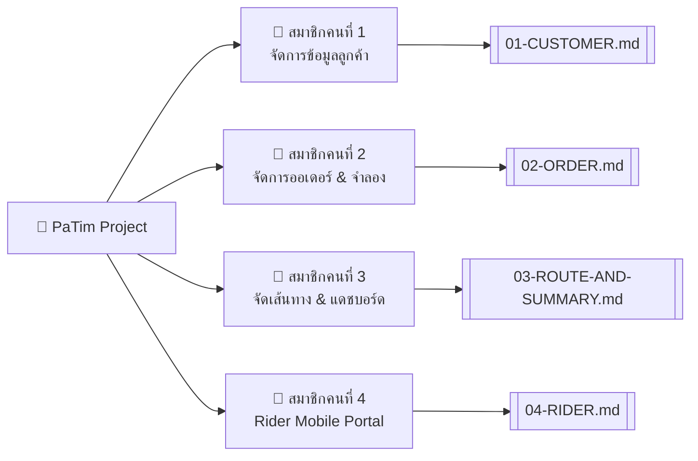

---
tags:
  - project/plan
  - angular
  - advweb
  - vrp-routing
created: 2026-10-04
title: แผนการพัฒนาโปรเจกต์ PaTim (ส่งด่วนมื้อเที่ยง)
---

# 🍱 แผนการพัฒนาโปรเจกต์ PaTim (ฉบับสมบูรณ์)
> [!INFO] **เป้าหมายโครงการ**
> **ระบบจัดเส้นทางและแบ่งงานไรเดอร์อัจฉริยะ (ส่งด่วนมื้อเที่ยง)**  
> บริเวณมหาวิทยาลัยมหาสารคาม (รัศมีไม่เกิน 3 กิโลเมตร)

---

## 📌 1. สรุปโจทย์และเงื่อนไขทางธุรกิจ (Business Rules)

> [!WARNING] **เงื่อนไขเหล็ก (Hard Constraints)**
> 1. **เวลาจัดส่ง:** เริ่มออกเดินทาง **11:30 น.** – สิ้นสุดไม่เกิน **12:30 น.** ($\le 60$ นาที) หากส่งเลททางร้านต้องจ่ายค่าชดเชย 20 บาท/ออเดอร์
> 2. **ความจุรถมอเตอร์ไซค์:** บรรทุกได้สูงสุด **ไม่เกิน 10 กล่อง / คัน**
> 3. **ขีดจำกัดต่อไรเดอร์:** รับงานได้ **ไม่เกิน 3 ออเดอร์ (3 จุดส่ง) / คน / รอบ**
> 4. **ความเร็วเฉลี่ยไรเดอร์:** คำนวณที่ $30\text{ กม./ชม.}$ (1 กม. ใช้เวลา $\approx 2$ นาที)

### 💰 โมเดลการเงินและสูตรคำนวณ (Financial Model)
- **ราคาขาย:** 65 บาท / กล่อง
- **ต้นทุนอาหาร:** 40 บาท / กล่อง
- **กำไรขั้นต้น:** $65 - 40 = 25$ บาท / กล่อง
- **ค่าบริการไรเดอร์ต่อรอบ:**
  - ค่าเรียกรถขั้นต่ำ: **15 บาท / ครั้ง / ไรเดอร์ 1 คน**
  - ค่าระยะทางขนส่ง: **2 บาท / กิโลเมตร / กล่อง**

$$
\text{ค่าขนส่งรวม (บาท)} = 15 + (\text{ระยะทางรวม (กม.)} \times 2 \times \text{จำนวนกล่องรวม})
$$

$$
\text{กำไรสุทธิ} = (\text{จำนวนกล่องรวม} \times 25) - \text{ค่าขนส่งรวม}
$$

---

## 🗺️ 2. ตารางการแบ่งงานสมาชิก 4 คน (Team Assignment)



| สมาชิก | หน้าที่รับผิดชอบ | Component / Page ที่ต้องทำ | API Endpoints ที่ต้องเชื่อมต่อ | คู่มือเฉพาะบุคคล |
|:---|:---|:---|:---|:---|
| **คนที่ 1** | **หน้าสำหรับจัดการข้อมูลลูกค้า** | `pages/customer-management`<br>ปักหมุด Leaflet Map, ค้นหาชื่อ, กรอง 1 กม. | `GET/POST/PUT/DELETE /api/customers`<br>`GET /api/customers?radius=1.0` | [[01-CUSTOMER\|01-CUSTOMER.md]] |
| **คนที่ 2** | **หน้าสำหรับจัดการออเดอร์** | `pages/order-management`<br>ฟอร์ม 1–3 กล่อง, จำลอง 20–30 ออเดอร์, ล้าง Mock, กรอง 2 กม. | `GET/POST/DELETE /api/orders`<br>`POST /api/orders/simulate`<br>`DELETE /api/orders/simulated` | [[02-ORDER\|02-ORDER.md]] |
| **คนที่ 3** | **หน้าจัดเส้นทาง & แดชบอร์ด** | `pages/route-dashboard`<br>ปุ่มจัดเส้นทาง 1 คลิก, เส้นทางแยกสีบน Leaflet, Re-calculate, แดชบอร์ดกำไร Real-time | VRP Routing Algorithm<br>`GET /api/orders?status=pending`<br>`POST/GET /api/delivery-batches` | [[03-ROUTE-AND-SUMMARY\|03-ROUTE-AND-SUMMARY.md]] |
| **คนที่ 4** | **หน้าไรเดอร์ (Mobile Portal)** | `pages/rider-portal`<br>Mobile-First, ค้นหา Job ID, สรุปจำนวนกล่อง, ลำดับจุดส่ง, เปิด Google Maps นำทาง | `GET /api/delivery-batches/:jobId`<br>`PATCH /api/delivery-batches/:jobId/stops/:stopId` | [[04-RIDER\|04-RIDER.md]] |

---

## 💻 3. โครงสร้างโปรเจกต์ (Project Structure)

```text
pa_tim/
├── Plan/                               # เอกสาร Obsidian คู่มือการทำงานของทีม
│   ├── PROJECT_PLAN.md                 # แผนแม่บทโครงการ
│   ├── 01-CUSTOMER.md                  # สมาชิกคนที่ 1: จัดการลูกค้า
│   ├── 02-ORDER.md                     # สมาชิกคนที่ 2: จัดการออเดอร์ & Simulation
│   ├── 03-ROUTE-AND-SUMMARY.md         # สมาชิกคนที่ 3: จัดเส้นทาง & แดชบอร์ด
│   ├── 04-RIDER.md                     # สมาชิกคนที่ 4: Rider Mobile Portal
│   └── 05-LEAFLET-GUIDE.md             # คู่มือการใช้งาน Leaflet Map
├── server/                             # Backend REST API (โฟลเดอร์แยก)
│   ├── src/                            # Controllers, Routes, Services, DB Models
│   ├── migrations/                     # SQL DDL Script (customers, orders, etc.)
│   └── .env.example
├── src/                                # Frontend Angular 22
│   ├── app/
│   │   ├── models/                     # Data Models (TypeScript Interfaces)
│   │   ├── services/                   # HttpClient Services
│   │   ├── components/                 # Shared Components (Header, Navbar)
│   │   ├── pages/                      # หน้าจอของสมาชิกทั้ง 4 คน
│   │   ├── app.config.ts               # provideHttpClient(), provideRouter()
│   │   └── app.routes.ts               # Routing Configuration
│   ├── environments/                   # environment.ts (apiUrl: http://localhost:3000/api)
│   └── styles.css                      # TailwindCSS & Leaflet CSS
```

---

## 🛠️ 4. ขั้นตอนการตั้งค่า Git และการเริ่มงาน (Git Workflow)

### 4.1 เริ่มต้น Clone และติดตั้ง
```bash
# 1. Clone repository ลงเครื่อง
git clone <REPOSITORY_URL>
cd pa_tim

# 2. ติดตั้ง Dependencies ฝั่ง Angular
npm install

# 3. ตรวจสอบ branch และดึงโค้ดล่าสุดจาก develop
git switch develop
git pull origin develop
```

### 4.2 การแตก Branch ประจำตัวสมาชิกแต่ละคน
```bash
# สมาชิกคนที่ 1:
git switch -c feature/customer-management

# สมาชิกคนที่ 2:
git switch -c feature/order-management

# สมาชิกคนที่ 3:
git switch -c feature/route-optimization

# สมาชิกคนที่ 4:
git switch -c feature/rider-portal
```

### 4.3 คำสั่งบันทึกงานและส่งงาน
```bash
git add .
git commit -m "feat: อธิบายรายละเอียดงานที่ทำ"
git pull origin develop
git push -u origin feature/<ชื่อฟีเจอร์>
```

---

## ⚙️ 5. การตั้งค่า Core ใน Angular

### 5.1 เปิดใช้งาน `provideHttpClient()` ใน `src/app/app.config.ts`
```typescript
import { ApplicationConfig, provideBrowserGlobalErrorListeners } from '@angular/core';
import { provideRouter } from '@angular/router';
import { provideHttpClient } from '@angular/common/http';
import { routes } from './app.routes';

export const appConfig: ApplicationConfig = {
  providers: [
    provideBrowserGlobalErrorListeners(),
    provideRouter(routes),
    provideHttpClient() // สำคัญ: เปิดใช้งาน HttpClient สำหรับเรียก API
  ]
};
```

### 5.2 การตั้งค่า Routing ใน `src/app/app.routes.ts`
```typescript
import { Routes } from '@angular/router';
import { CustomerManagement } from './pages/customer-management/customer-management';
import { OrderManagement } from './pages/order-management/order-management';
import { RouteDashboard } from './pages/route-dashboard/route-dashboard';
import { RiderPortal } from './pages/rider-portal/rider-portal';

export const routes: Routes = [
  { path: '', redirectTo: 'routes', pathMatch: 'full' },
  { path: 'customers', component: CustomerManagement, title: 'จัดการลูกค้า - PaTim' },
  { path: 'orders', component: OrderManagement, title: 'จัดการออเดอร์ - PaTim' },
  { path: 'routes', component: RouteDashboard, title: 'จัดเส้นทาง & แดชบอร์ด - PaTim' },
  { path: 'rider', component: RiderPortal, title: 'Rider Portal - PaTim' },
  { path: '**', redirectTo: 'routes' }
];
```

---

## 📚 6. ลิงก์เอกสารอ้างอิงและคู่มือประจำแต่ละส่วน
- 📖 [[01-CUSTOMER|คู่มือสมาชิกคนที่ 1: ระบบจัดการข้อมูลลูกค้า]]
- 📖 [[02-ORDER|คู่มือสมาชิกคนที่ 2: ระบบจัดการออเดอร์และการจำลองข้อมูล]]
- 📖 [[03-ROUTE-AND-SUMMARY|คู่มือสมาชิกคนที่ 3: ระบบจัดเส้นทางและแดชบอร์ดสรุปยอด]]
- 📖 [[04-RIDER|คู่มือสมาชิกคนที่ 4: ระบบไรเดอร์ Mobile Portal]]
- 📖 [[05-LEAFLET-GUIDE|คู่มือการใช้งานแผนที่ Leaflet ใน Angular]]
